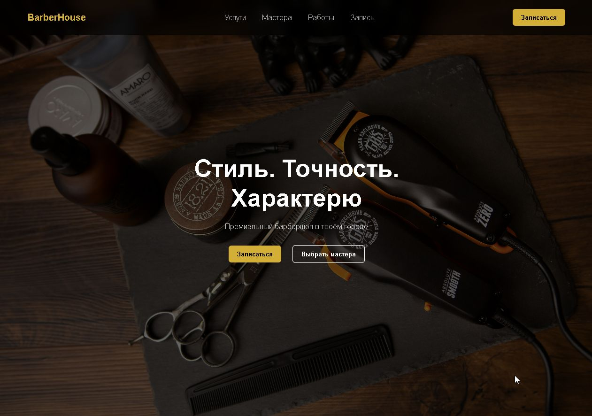
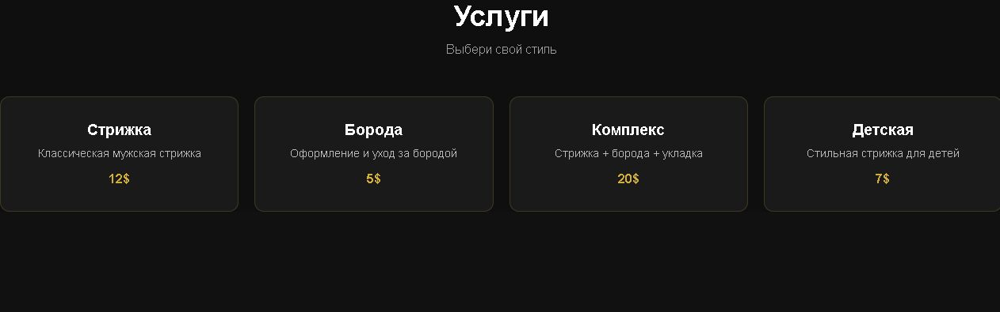
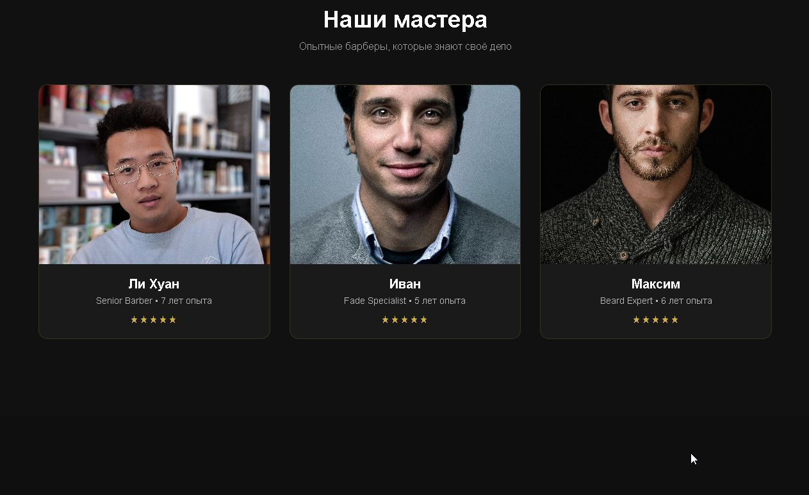
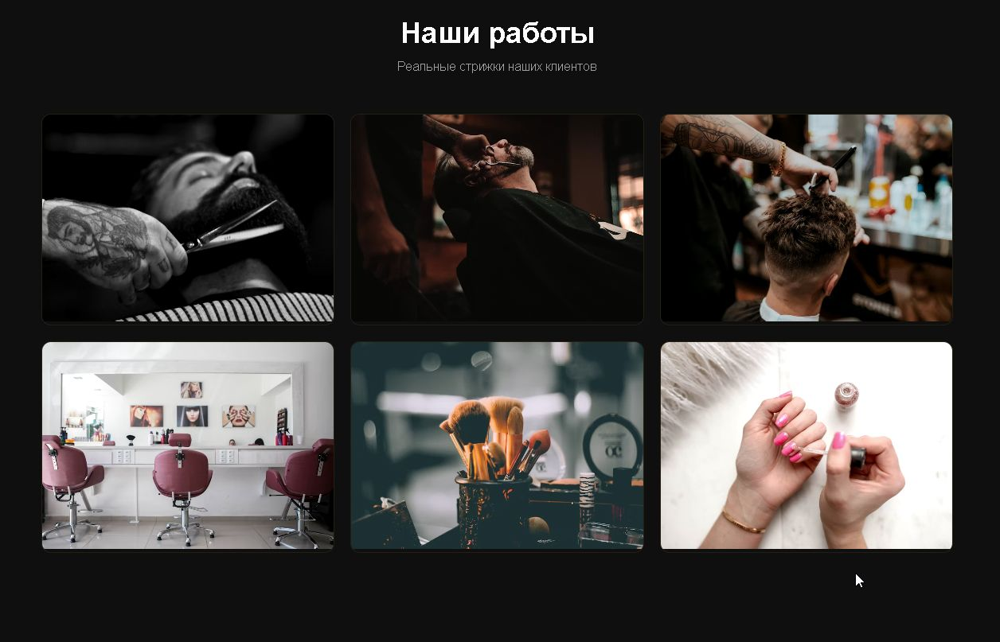
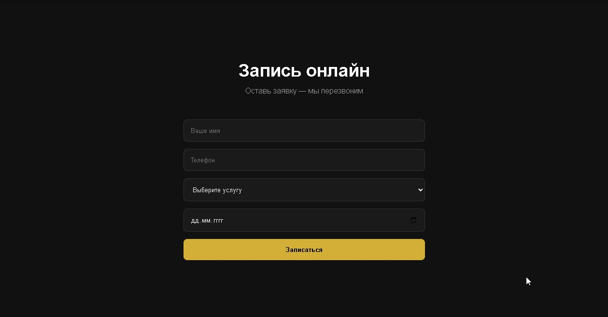

## Barbershop Landing Page

## О проекте:

Современный адаптивный лендинг для барбершопа с фокусом на UI/UX и конверсию.

Проект включает в себя:

- Hero секцию с приятным атмосферным дизайном
- Каталог услуг
- Блок мастеров
- Галерею работ
- Форму онлайн-записи

---

## Технологии:

- HTML5
- CSS3 (Flexbox + Grid)
- JavaScript (Vanilla)
- Responsive Design

---

## Функционал приложения:

- Плавная навигация по секциям
- Адаптив под мобильные устройства
- Hover-анимации
- Форма записи (mock submission)

---

## Цель данного проекта:

Практика создания коммерческих лендингов и подготовка портфолио для фриланса / junior frontend вакансий.

---

## Preview:

### Hero Section

### Services

### Masters

### Gallery

### Booking

---

## Автор работы:

Frontend developer Karpov Ilia (junior)
